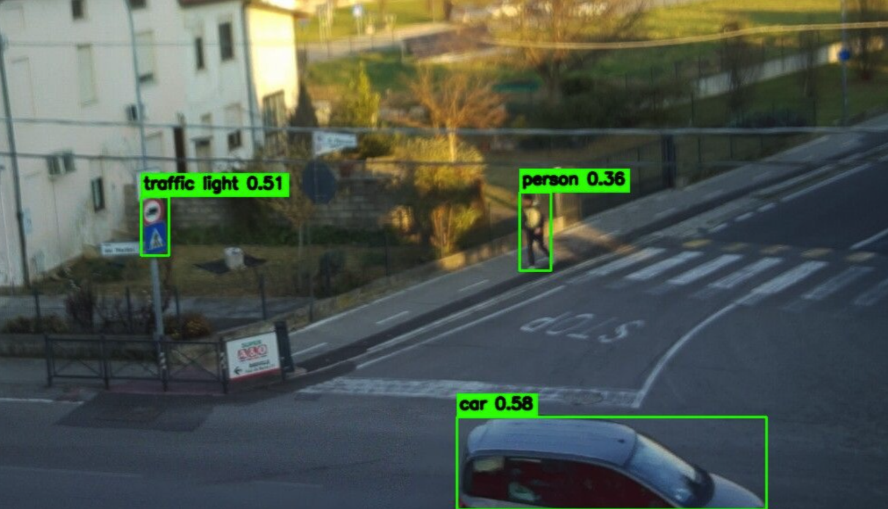

# Raspberry Pi Camera - Live streaming Image Recognition

Web server in python that exposes endpoints.

- /camera
- /camera/stream

### /camera

Return a shot of the camera with image recognition.

### /camera/stream

Live streaming with live image recognition.

